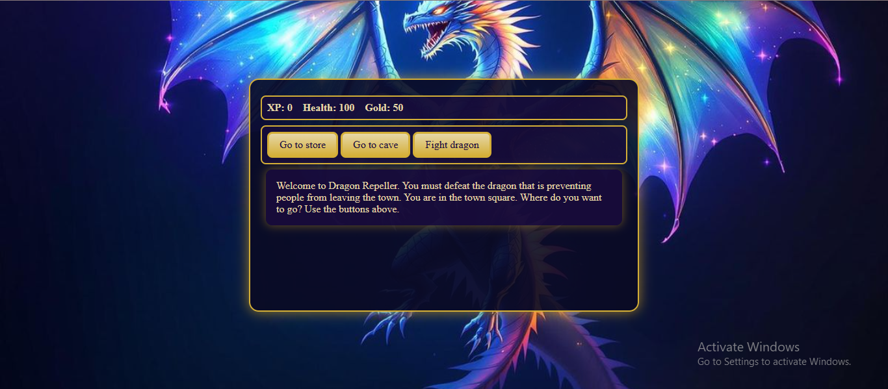

# 🐉 Dragon Repeller RPG

A fun **text-based role-playing game (RPG)** built with **HTML, CSS, and JavaScript**.
Your mission: **Defeat the dragon** that’s preventing the townspeople from leaving! 🏰

## 📸 Screenshots

🔗 **Live Demo:** \[Your GitHub Pages Link Here]

---

## 🎮 Gameplay

* Start in the **Town Square** and choose your path:

  * 🛒 **Store:** Buy health or upgrade weapons.
  * 👾 **Cave:** Fight monsters to earn XP & gold.
  * 🐉 **Dragon Lair:** Face the final boss.

* **Player Stats:**

  * XP (gain power with victories)
  * Health (don’t let it drop to 0!)
  * Gold (buy upgrades & health)
  * Weapons (stick → dagger → hammer → sword)

* **Combat Options:**

  * ⚔️ Attack (deal damage based on weapon & XP)
  * 🌀 Dodge (avoid attacks)
  * 🏃 Run (retreat to town)

* **Monsters:**

  * Slime (weak but annoying)
  * Fanged Beast (deadlier)
  * The Dragon (the ultimate test)

* Bonus: 🎲 *Easter Egg Mini-Game* where luck can earn you gold… or cost you health!

---

## 🛠️ Features

* Fully interactive using **DOM manipulation** & **event listeners**
* Dynamic **UI updates** (stats, combat messages, locations)
* Simple but engaging **resource management**
* **Fantasy-inspired design** with custom styling
* Mobile responsive for play anywhere 📱

---

## 🚀 Tech Stack

* **HTML5** for structure
* **CSS3** for styling & theme
* **JavaScript (ES6)** for game logic & interactivity

---

## 🕹️ Play Now

🔗 **Live Demo:** \[Your GitHub Pages Link Here]
🔗 **github Demo:** \[https://github.com/kal1kidan/RolePlayingGame]
📂 **Source Code:** This repo 👆

---
## 👨‍💻 Author
Made with ❤️ as part of my **#100DaysOfCode challenge**.

